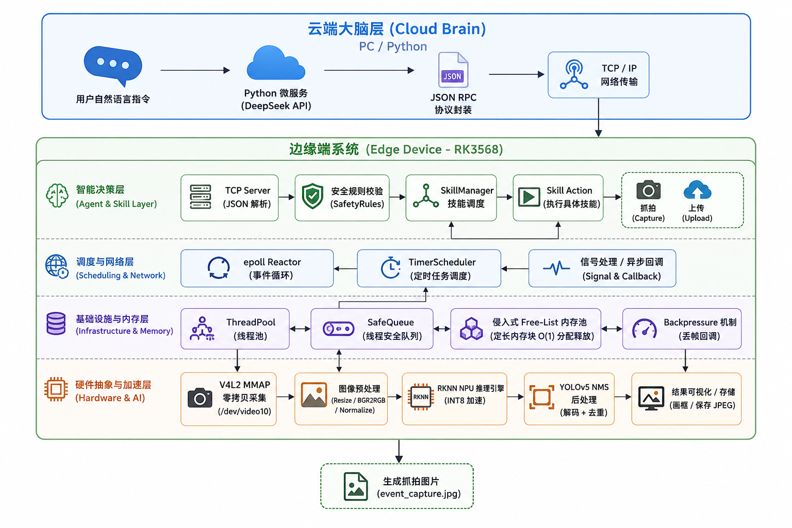

# EdgeVision-Agent：基于自研异步框架与 RK3568 的边缘智能体系统

[](https://en.cppreference.com/w/cpp/17)
[](https://www.rock-chips.com/)
[](https://www.deepseek.com/)

## 项目简介

针对边缘设备在视频采集与 AI 决策时面临的**并发瓶颈**与**内存碎片**问题，本项目从零自研 C++ 异步运行时框架，基于 **RK3568 NPU** 实现端到端的视觉感知与决策闭环。项目采用**云边协同**架构，边缘端负责高性能感知与实时执行，云端 Python 微服务对接 **DeepSeek API**，实现了“自然语言驱动、边缘实时响应”的智能体（Agent）系统。

---

## 🏗️ Architecture

> 📌 请确保架构图文件 `architecture.png` 与本 `README.md` 位于同一目录下。



---

## Architecture Overview

- **硬件抽象与加速层**：基于 V4L2 与 MMAP 实现零拷贝采集，通过 RKNN API 驱动 NPU 完成 YOLOv5 硬件推理与 NMS 后处理。
- **基础设施与内存层**：自研侵入式 Free-List 定长内存池与线程安全队列，实现了 O(1) 的内存分配与背压降级机制。
- **调度与网络层**：基于 `epoll` 事件驱动与 `timerfd` 最小堆定时器，构建单线程 Reactor 模型，支撑高频事件处理与软实时调度。
- **智能决策层**：通过 `SkillManager` 与 `SafetyRules` 实现动作解耦，将硬件感知结果抽象为可插拔的 Skill 技能。
- **云端大脑层**：Python 微服务对接大模型 API，将用户自然语言解析为 JSON RPC 指令，通过 TCP 下发至边缘端执行。

---

## ✨ Features

- **自研异步运行时**：纯手工打造 C++ 底层框架，包含线程池、事件驱动、软实时定时器，全程无依赖第三方框架。
- **零拷贝与零碎片**：基于 MMAP 的 V4L2 采集与基于 Free-List 的侵入式内存池，彻底消灭 `memcpy` 与 `malloc` 开销。
- **硬件级 AI 推理**：量化部署 YOLOv5s INT8 模型至 RK3568 NPU，实测单帧推理仅需 **54ms**。
- **云边端协同 Agent**：打通 DeepSeek 大模型 API，支持自然语言遥控边缘端摄像头（如“抓拍一张”即可触发本地捕捉）。
- **工程完整性**：项目结构分层清晰，包含内存防泄漏回调和安全规则校验，经 Valgrind 验证零泄漏。

---

## 🛠️ Tech Stack

| 领域 | 技术选型 |
| :--- | :--- |
| **编程语言** | C++17, Python 3 |
| **操作系统与硬件** | Linux (RK3568 ARMv8), NPU |
| **硬件驱动** | V4L2, MMAP, RKNPU SDK |
| **C++ 框架** | 自研 (epoll, timerfd, 最小堆, ThreadPool, MemoryPool) |
| **AI 模型与推理** | YOLOv5s, RKNN C API, INT8 量化 |
| **云端大模型** | DeepSeek API (兼容 OpenAI) |
| **网络协议** | TCP, JSON RPC |
| **构建系统** | CMake, Make |

---

## 📊 Performance

| 指标 | 测量数据 |
| :--- | :--- |
| **NPU 单帧推理耗时** | **~54 ms** (YOLOv5s, 640x640) |
| **系统吞吐量** | 约 18 FPS (实时感知) |
| **内存分配耗时** | 从微秒级降至 **纳秒级** (内存池) |
| **系统稳定性** | 24 小时连续运行无 OOM 与内存泄漏 (Valgrind 验证) |

---

## 🚀 Build & Run

### 1. 编译项目
在板子上执行以下命令一键编译：
```bash
mkdir -p build && cd build
cmake ..
make -j$(nproc)
